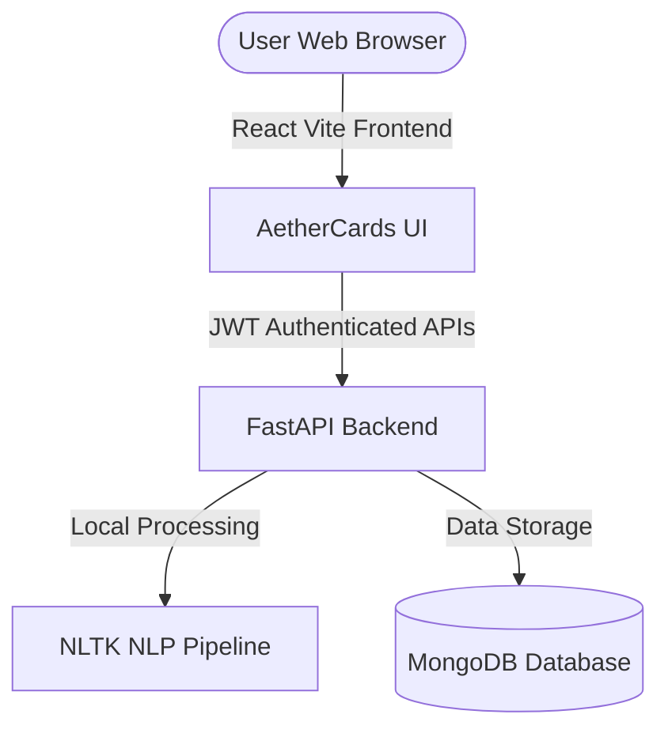

# AetherCards - Smart AI Flashcard Generator

AetherCards is a premium web application designed for students to convert study notes into flashcards automatically using Natural Language Processing (NLP) and study them using an optimized spaced repetition Leitner system. 

The application is built with a **FastAPI** backend, a **React (Vite)** frontend with custom glassmorphism styling, and a **MongoDB** database.

---

## Key Features

1. **Secure User Authentication**: Full user signup and login with secure password hashing (`bcrypt`) and JWT access token guards.
2. **Local NLP Card Generator**: Uses a local NLP pipeline powered by `nltk` to parse paragraphs, identify copula definitions ("X is Y"), extract proper noun entities (e.g. "Albert Einstein"), and construct fill-in-the-blank cards.
3. **Leitner Spaced Repetition System**: Automatically groups flashcards into 5 boxes. Marking cards "Known" schedules them further out (increasing box level); marking them "Not Known" resets them back to Box 1 for immediate review.
4. **"Demo Mode" Scheduler**: An interactive toggle inside the review interface that compresses Leitner review intervals into seconds/minutes (Box 1 = 10s, Box 2 = 30s, Box 3 = 1m, Box 4 = 2m, Box 5 = 5m). **Perfect for showing reviewers/interviewers the spaced repetition math in real-time.**
5. **Modern Glassmorphic Dark UI**: Custom-built CSS system featuring Outfit & Plus Jakarta Sans typography, neon glowing badges, 3D card flip transitions, and statistical dashboard panels.

---

## Technical Stack & Architecture



* **Frontend**: React (Vite) + Vanilla CSS (Custom design variables, 3D CSS flips).
* **Backend**: FastAPI + PyMongo + NLTK (Natural Language Toolkit) for offline AI processing.
* **Database**: MongoDB (configured for local dev or MongoDB Atlas free tier in production).
* **NLP Approach**: 
  - *Copula Definition Extraction*: Matches copula structures (e.g., *Photosynthesis is [definition]*), extracts subjects as answers, and constructs: *"Fill in the blank: [_____] is [definition]."*
  - *Proper Noun/Common Noun Cloze Deletion*: Identifies named entities or major subjects using Part-of-Speech (POS) tags and masks them to test memory.

---

## Local Setup Instructions

### 1. Prerequisites
* Python 3.8+ (Supports Python 3.14!)
* Node.js (v18+)
* MongoDB running locally (default port `27017`) or a MongoDB Atlas connection URI.

---

### 2. Backend Setup
1. Open a terminal and navigate to the backend directory:
   ```bash
   cd backend
   ```
2. Create and activate a Python virtual environment:
   ```bash
   # On Windows
   python -m venv venv
   .\venv\Scripts\activate
   
   # On macOS/Linux
   python3 -m venv venv
   source venv/bin/activate
   ```
3. Install the dependencies:
   ```bash
   pip install -r requirements.txt
   ```
4. Configure environment variables in `.env` file (one has been pre-created for you):
   ```env
   MONGODB_URL=mongodb://127.0.0.1:27017
   DB_NAME=smart_flashcards
   SECRET_KEY=supersecretkeyforflashcardgeneratorapp12345
   JWT_ALGORITHM=HS256
   ACCESS_TOKEN_EXPIRE_MINUTES=1440
   ENV=development
   ```
5. Run the backend server:
   ```bash
   uvicorn app.main:app --reload --port 8000
   ```
   The API will start running at `http://localhost:8000`. You can inspect the interactive documentation at `http://localhost:8000/docs`.

---

### 3. Frontend Setup
1. Open a new terminal and navigate to the frontend directory:
   ```bash
   cd frontend
   ```
2. Install the node packages:
   ```bash
   npm install
   ```
3. Run the development server:
   ```bash
   npm run dev
   ```
   The React application will launch at `http://localhost:3000`.

---

## Deployment Guide

This app is architected for free-tier deployments:

### Backend Deployment (Render)
1. Push your backend directory (or a monorepo setup) to GitHub.
2. Sign up on [Render](https://render.com) and create a new **Web Service**.
3. Link your repository.
4. Set the following build settings:
   - **Environment**: `Python`
   - **Build Command**: `pip install -r requirements.txt`
   - **Start Command**: `uvicorn app.main:app --host 0.0.0.0 --port $PORT`
5. In the **Environment Variables** tab, add your production environment keys:
   - `MONGODB_URL`: Your MongoDB Atlas Free Tier connection string (`mongodb+srv://...`).
   - `SECRET_KEY`: A secure random string for JWT signatures.
   - `DB_NAME`: e.g. `aethercards_prod`.
   - `ENV`: `production`.

### Frontend Deployment (Vercel)
1. Push your frontend directory to GitHub.
2. Sign up on [Vercel](https://vercel.com) and import your repository.
3. Configure the framework as **Vite**.
4. Set the **Build Command** to `npm run build` and the output directory to `dist`.
5. Set the **Environment Variable**:
   - `VITE_API_URL`: Your Render Web Service URL (e.g. `https://aethercards-api.onrender.com`).
6. Click **Deploy**. Vercel will build your static files and host them with high-speed global availability.
